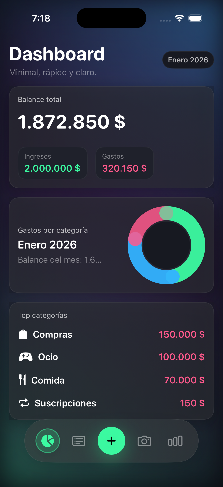
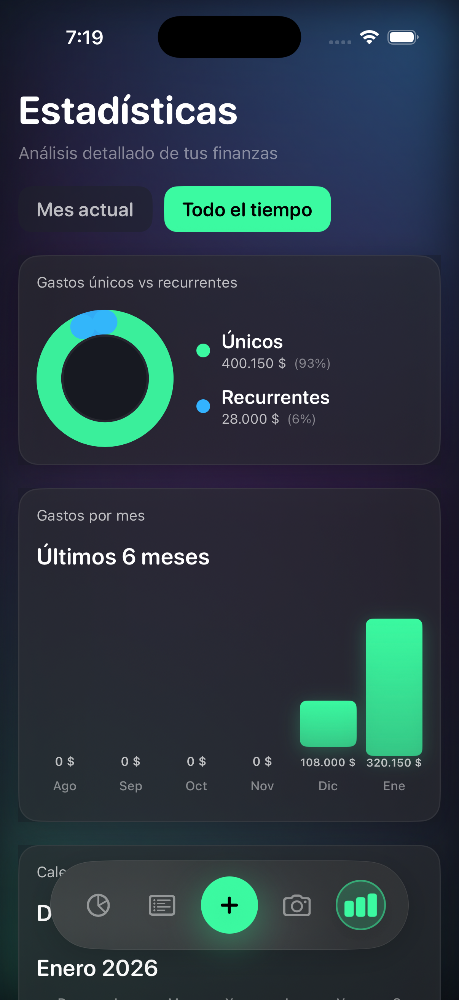
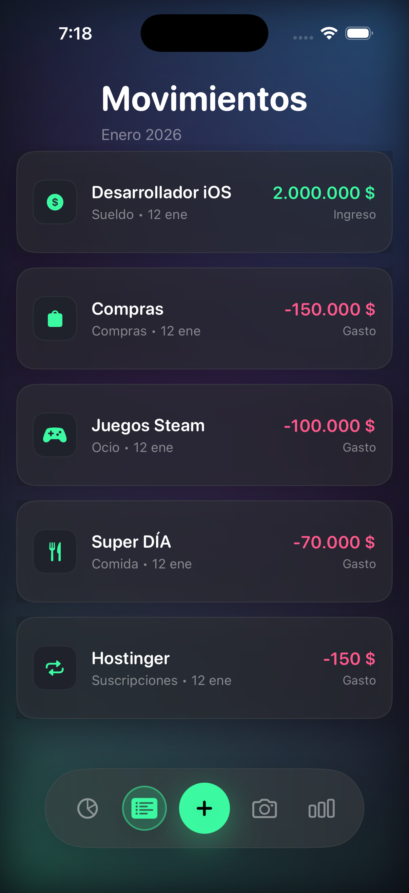
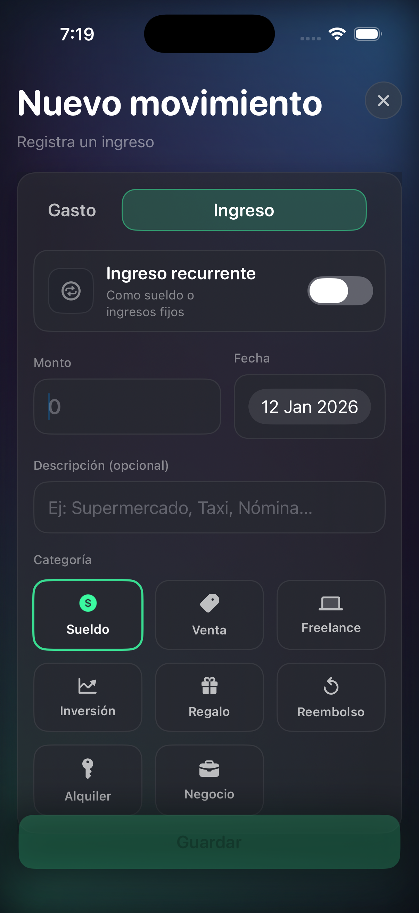

# 📱 FinanzasApp — Personal Finance Tracker for iOS


> Minimal, fast and modern personal finance app built with **Swift** and **Xcode**. Track your income and expenses, scan tickets, visualize spending trends and keep full control of your personal finances — all with a clean, native iOS experience.

---

## 🚀 Overview

**FinanzasApp** is a native iOS application designed to help users **organize, analyze, and understand their personal finances** in a simple and visual way.

It allows you to:

* Register **income and expenses** with categories
* Visualize your **monthly balance**
* Analyze spending with **charts and statistics**
* Track **positive and negative days** on a financial calendar
* Scan tickets to **auto-detect expenses**

This project is also an exploration of a modern development workflow using **Cursor + Xcode**, focusing on clean architecture, scalable UI, and production-ready Swift patterns.

---

## 🧩 Features

### 📊 Dashboard

* Monthly balance overview
* Total income vs total expenses
* Category-based spending visualization
* Clean and minimal UI for fast insights

### 🧾 Ticket Scanner

* Open camera or gallery
* Detect expenses from photos
* Fast entry for real-world purchases

### 📅 Balance Calendar

* Highlights **positive days**, **negative days**, and **no-movement days**
* Monthly navigation
* Visual financial health indicator

### 📈 Statistics

* Unique vs recurring expenses
* Spending trends over time
* Last 6 months visualization

### 🧾 Movements

* Detailed transaction history
* Category-based filtering
* Income and expense separation

### ➕ New Transaction

* Income / Expense toggle
* Recurring income support
* Category selector
* Date picker
* Clean form validation

---

## 🖼️ Screenshots

| 🏠 Home | 📚 Statistics | 📚 Statistics Detailed |
|:--------:|:------------------:|:---------------:|
|  |  |  |

| 🏠 Scan Ticket | 📚 Movements | 📚 New Movement |
|:--------:|:------------------:|:---------------:|
|  |  |  |

---

## 🛠️ Tech Stack

* **Language:** Swift 5.9+
* **IDE:** Xcode 15+
* **Platform:** iOS 17+
* **UI Framework:** SwiftUI
* **Architecture:** MVVM
* **Persistence:** Local storage (SwiftData / Core Data ready)
* **Charts:** Native SwiftUI Charts
* **Camera & Media:** AVFoundation / PhotosUI

---

## 🧱 Architecture

The project follows a **scalable MVVM structure**:

```
FinanzasApp
├── Models
├── Views
│   ├── Dashboard
│   ├── Statistics
│   ├── Movements
│   └── Scanner
├── ViewModels
├── Services
│   ├── Persistence
│   └── OCR / Image Processing
└── Resources
```

### Key Principles

* **Separation of concerns**
* **Testable ViewModels**
* **Reusable UI components**
* **Scalable data layer**

---

## ⚡ Development Workflow

This project explores a modern workflow using:

* **Cursor** → AI-assisted coding, refactors, and documentation
* **Xcode** → Native debugging, previews, and profiling

The goal is to maintain:

* Clean commits
* Readable code
* Production-grade structure

---

## 📦 Installation

### Requirements

* macOS Sonoma or newer
* Xcode 15+
* iOS 17+ Simulator or device

### Steps

```bash
git clone https://github.com/GermanBonnettini/FinanzasApp.git
cd FinanzasApp
open FinanzasApp.xcodeproj
```

Run the app on a simulator or physical device from Xcode.

---

## 🔐 Permissions

The app requires the following permissions:

* **Camera** — Ticket scanning
* **Photos** — Import receipts from gallery

These are declared in `Info.plist`:

* `NSCameraUsageDescription`
* `NSPhotoLibraryUsageDescription`

---

## 🧪 Roadmap

* [ ] Cloud sync (iCloud / Supabase / Firebase)
* [ ] Export reports (PDF / CSV)
* [ ] Smart budget limits
* [ ] Face ID / Touch ID lock
* [ ] AI-powered expense categorization
* [ ] Multi-currency support

---

## 👨‍💻 Author

**Germán Bonnettini**
📍 Argentina
💼 iOS Developer | Mobile Apps | Game & SaaS Builder

* GitHub: [@GermanBonnettini](https://github.com/GermanBonnettini)
* Portfolio: Matecode Studio

---

## ⭐ Why This Project

This app was built to demonstrate:

* Strong **SwiftUI architecture**
* Real-world **data handling**
* Clean **UX/UI design principles**
* Production-ready **scalability**

It is designed as both a **personal finance tool** and a **professional portfolio project** for iOS development roles.

---

## 📄 License

This project is licensed under the **MIT License**.
Feel free to use, modify, and distribute.

---

> If you find this project useful, consider giving it a ⭐ on GitHub — it helps a lot!
